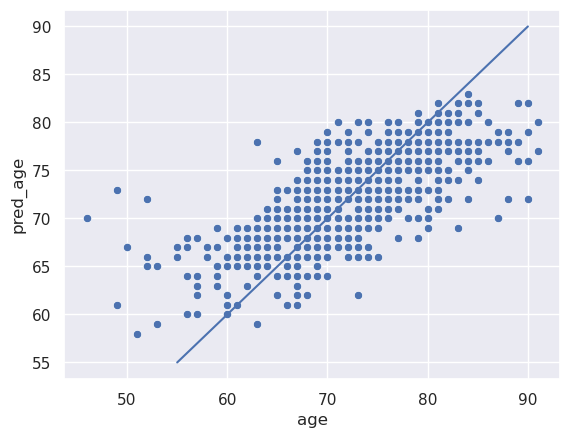

<h1 align="center">
  <br>
  brainage 
  <br>
</h1>

<p align="center">
  
</p>

Unofficial implementation of "[Accurate brain‐age models for routine clinical MRI examinations](https://www.sciencedirect.com/science/article/pii/S1053811922000015?via%3Dihub#fig0003)". 

For the official implementation, [see here](https://github.com/MIDIconsortium/BrainAge).

## Installation

Clone the repository:

```bash
git clone https://github.com/LemuelPuglisi/brainage
````

You can install the dependency by running the command below. However, I recommend to install PyTorch separately.

```bash
pip install -r requirements.txt
```

Install the `brainage` package

```bash
pip install . # or -e . for development
```

## Pretrained model

A pretrained model is provided in the `models` folder. The model has been trained on T1w brain MRIs from Cognitively Normal subjects from ADNI, AIBL and OASIS 3. All the T1w Brain MRIs have been preprocessed using `Turboprep` ([see here](https://github.com/LemuelPuglisi/turboprep)). The Mean Absolute Error of this model (from a separate test set) is $3.80$ and matches the performances reported in the paper.


## Usage

List your inputs in a CSV file following this structure:
```csv
id,image_path
image1,image1_path
image2,image1_path
...
imagen,imagen_path
```
where image_path is the absolute path of the nifti file of the T1-w brain MRI. Please preprocess your MRIs using `Turboprep` ([see here](https://github.com/LemuelPuglisi/turboprep)).

Then run the following command:

```bash
brainage --checkpoints models/densenet-t1w.pth \
         --input <csv_path>  \
         --output <output_path> \
         --gpu # if a GPU is available
```